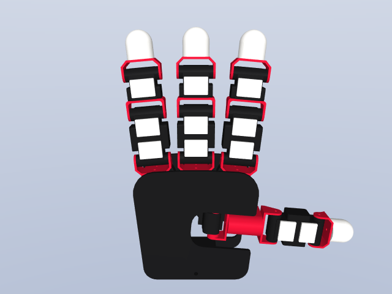
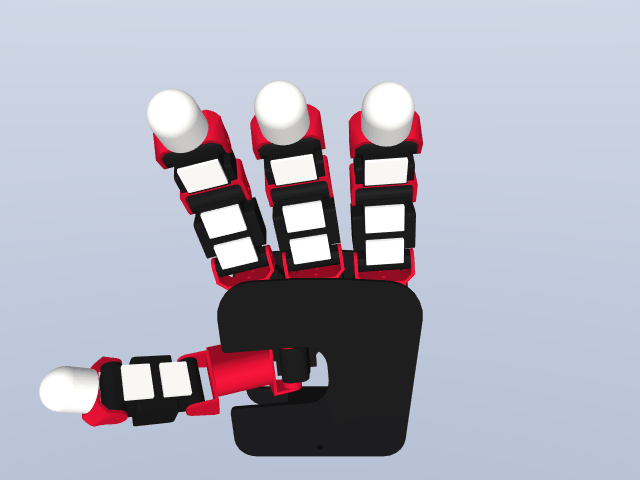
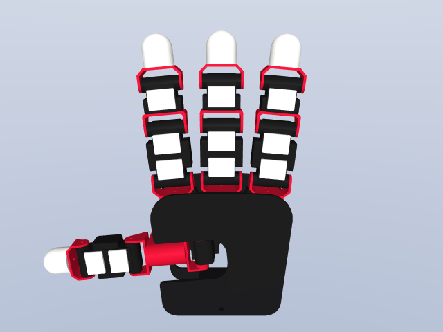
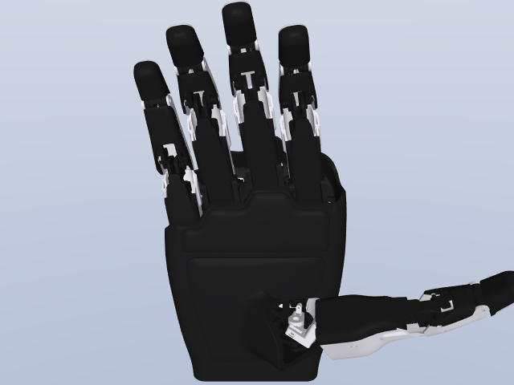
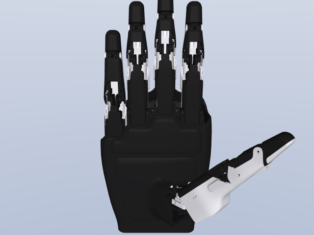
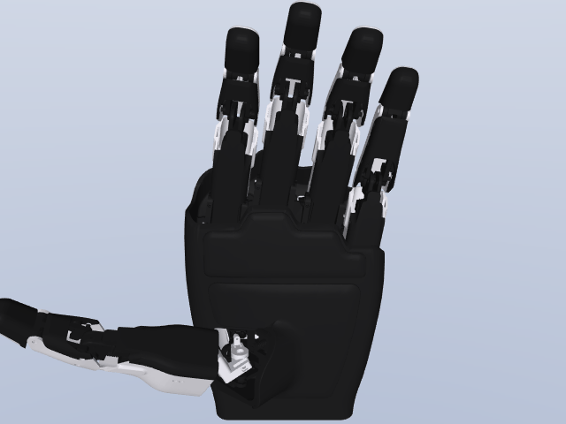
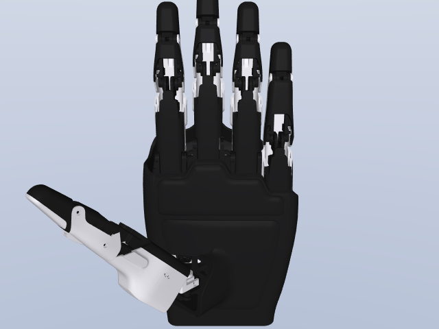

# KISTAR_URDF

> **CAD:** [**Sungwoo Park**](https://github.com/psw2939) (Korea University / KIST)  
> **URDF / MJCF / STL conversion:** **Jaesung Lee** ([KIST](https://www.kist.re.kr))

Open-source **URDF** and **MuJoCo MJCF** distribution of the KISTAR Hand family,
developed at [Korea Institute of Science and Technology](https://www.kist.re.kr).
Mesh geometry in this repository is derived from Sungwoo Park's mechanical CAD;
STEP source files are not distributed here.

This repository follows the structural convention of
[KIST-PRIME-Lab/dex-urdf](https://github.com/KIST-PRIME-Lab/dex-urdf), so
each robot lives under `robots/hands/<model_name>/` together with its meshes.

> Copyright © 2026 Korea Institute of Science and Technology &nbsp;·&nbsp; License: **BSD-3-Clause**

---

## Models

| Robot Model        | Animation                                                          | Still pose                                                   | Format       |
| ------------------ | ------------------------------------------------------------------ | ------------------------------------------------------------ | ------------ |
| **KISTAR Hand (R)** |           |         | URDF + MJCF  |
| **KISTAR Hand (L)** |             |           | URDF + MJCF  |
| **KISTAR-SON (R)** |             |           | URDF + MJCF  |
| **KISTAR-SON (L)** |               |             | URDF + MJCF  |

> The preview GIFs and PNGs above are generated directly from the MJCF files.
> Reproduce them any time with:
>
> ```bash
> python tools/render_previews.py
> ```
>
> See [`doc/RENDER.md`](doc/RENDER.md) for alternative rendering workflows
> (MuJoCo viewer screenshots, SAPIEN ray tracing, yourdfpy).

---

## Repository Layout

```
KISTAR_URDF/
├── LICENSE                        # BSD-3-Clause (Korea Institute of Science and Technology)
├── CITATION.cff
├── README.md                      # this file
├── doc/                           # placeholder figures + render guide
│   ├── kistar_hand_placeholder.svg
│   ├── kistar_son_left_placeholder.svg
│   ├── kistar_son_right_placeholder.svg
│   └── RENDER.md
└── robots/
    └── hands/
        ├── kistar_hand/           # KISTAR Hand Ver2 (4 fingers, left + right)
        │   ├── kistar_hand_right.urdf
        │   ├── kistar_hand_left.urdf
        │   ├── kistar_hand_right.xml
        │   ├── kistar_hand_left.xml   # MuJoCo MJCF (16 joints / 16 actuators)
        │   ├── README.md
        │   └── 01_kistar_hand_stl/*.STL
        └── kistar_son/            # KISTAR-SON (5 fingers, left + right)
            ├── kistar_son_right_mockup.urdf
            ├── kistar_son_left_mockup.urdf
            ├── kistar_son_right.xml
            ├── kistar_son_left.xml
            ├── README.md
            └── 01_kistar_son_STL/*.STL
```

---

## Quick Start

### 1. Install dependencies

```bash
conda create -n kistar-urdf python=3.11 -y
conda activate kistar-urdf
pip install mujoco yourdfpy numpy
```

### 2. Open a model in MuJoCo

```bash
# KISTAR Hand (Ver2, right)
python -m mujoco.viewer --mjcf=robots/hands/kistar_hand/kistar_hand_right.xml

# KISTAR Hand (Ver2, left)
python -m mujoco.viewer --mjcf=robots/hands/kistar_hand/kistar_hand_left.xml

# KISTAR-SON (right)
python -m mujoco.viewer --mjcf=robots/hands/kistar_son/kistar_son_right.xml

# KISTAR-SON (left)
python -m mujoco.viewer --mjcf=robots/hands/kistar_son/kistar_son_left.xml
```

In the viewer:

- **Left panel "Control"** — move the sliders to drive each actuated joint
- **Mouse left-drag** — orbit the view
- **Mouse right-drag** — pan
- **Mouse wheel** — zoom
- **Space** — pause / resume
- **Backspace** — reset all joints to zero

### 3. Open a URDF in your favorite parser

URDF files are compatible with: `yourdfpy`, RViz, Gazebo, IsaacGym, IsaacSim, SAPIEN, PyBullet, ...

```python
import yourdfpy
robot = yourdfpy.URDF.load("robots/hands/kistar_hand/kistar_hand_right.urdf")
robot.show()
```

---

## Model Specifications

### KISTAR Hand (Ver2)

| Item              | Value                                                                |
| ----------------- | -------------------------------------------------------------------- |
| Fingers           | 4 (thumb, index, middle, ring)                                       |
| Total joints      | 16 hinge                                                             |
| Actuators         | 16 position actuators per hand                                       |
| Mimic / Coupling  | none (all joints independently actuated)                             |
| Sensors           | thumb 2 / index, middle, ring 3 each (modeled as welded bodies)      |
| PD gains (MJCF)   | `kp=30`, `kv=0.7`, force range ± 100 N·m                             |
| Contact (MJCF)    | disabled (kinematic preview by default)                              |

### KISTAR-SON

| Item              | Value                                                            |
| ----------------- | ---------------------------------------------------------------- |
| Fingers           | 5 (thumb, index, middle, ring, little)                           |
| Total joints      | 20 hinge per hand                                                |
| Actuators         | 15 position actuators per hand                                   |
| Mimic / Coupling  | `*_3_joint` ↔ `*_2_joint` (index, middle, ring), `thumb_4` ↔ `thumb_3`, `little_2` ↔ `little_1` |
| PD gains (MJCF)   | `kp=30`, `kv=0.7`, force range ± 100 N·m                         |
| Contact (MJCF)    | disabled (kinematic preview by default)                          |

---

## Robot Source

| Robot Model    | Author / Affiliation                                          | License | Origin                                                                                   |
| -------------- | ------------------------------------------------------------- | ------- | ---------------------------------------------------------------------------------------- |
| KISTAR Hand    | Jaesung Lee, Korea Institute of Science and Technology        | BSD-3   | [KIST-PRIME-Lab/Franka_Dual_Arm_PtoP](https://github.com/KIST-PRIME-Lab/Franka_Dual_Arm_PtoP) |
| KISTAR-SON     | Jaesung Lee, Korea Institute of Science and Technology        | BSD-3   | KIST internal                                                                            |

Reference repositories that inspired this layout:

- [KIST-PRIME-Lab/dex-urdf](https://github.com/KIST-PRIME-Lab/dex-urdf) — Dexterous robotic hands collection

---

## Citation

If you use these models, please cite:

```bibtex
@misc{kistar_urdf_2026,
  title  = {KISTAR Hand URDF / MJCF Distribution},
  author = {Jaesung Lee},
  year   = {2026},
  note   = {Korea Institute of Science and Technology},
  url    = {https://github.com/JayLee00/KISTAR_URDF}
}
```

---

## License

[BSD-3-Clause](LICENSE) © 2026 Korea Institute of Science and Technology.
Maintainer: **Jaesung Lee** &lt;jay.lee@kist.re.kr&gt;.
